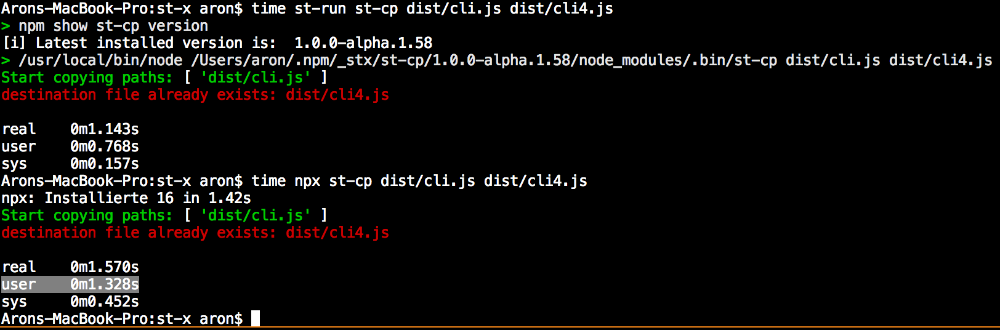
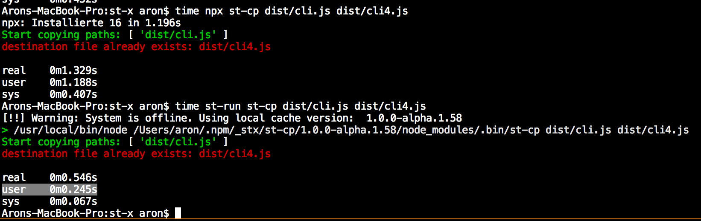

### `npx` replacement: `st-run st-rm-rf dist + system:tsc`

> 💨Just like `npx` but chainable, way faster and always using `@latest` of any command 💨

> 🎉 Get rid of node scripts to chain commands 🎉

> 🚀Get rid of direct & out-dated CLI dependencies 🚀

> 🧑‍🤝‍🧑 Cross-platform and end-2-end tested ✨

#### Performance

~2x faster than `npx` when your machine is online:




~5x faster than `npx` when your machine is offline:



And it always checks for the `@latest` version when your machine is online.

#### Usage

You can use `st-run` in npm scripts [like this](https://github.com/springtype-org/st-run/blob/master/package.json#L23):

```
{
    "name": "your-node-module",
    "scripts": {
        "copy-smth": "st-run st-cp package.json package.json2"
    },
    "dependencies": {
        "st-run": "latest"
    }
}
```


This way you may *get rid of some direct dependencies* and make sure the CLI tools being _used by end-users are always up to date_.

Or install it globally like `npx`:

    npm i -g st-run

And use it globally just like `npx`:

    st-run st-cp package.json package.json2


#### `commandA arg1 + commandB arg1 arg2` Chaining Syntax

You can get rid of special node scripts to chain commands by letting `st-run` chain them for you:

    st-run st-cp package.json package.json2 + st-cp package.json2 package.json3

As you can see, a simple `+` chains two or more commands. There is no command count limit.

#### `command@specificVersion` Syntax

With `st-run` you can have multiple cached versions at the same time (just like with `maven`, `gradle` etc.):

    st-run st-cp@1.0.0 package.json package.json2 + st-cp@2.0.0 package.json2 package.json3

Cool?

### `system:command` Syntax

Oh, you want to run a command that is not an npm script? `st-run` got you covered:

    st-run system:rm -rf dist + system:tsc

This also works for globally installed npm packages that you don't want to update on-the-fly.